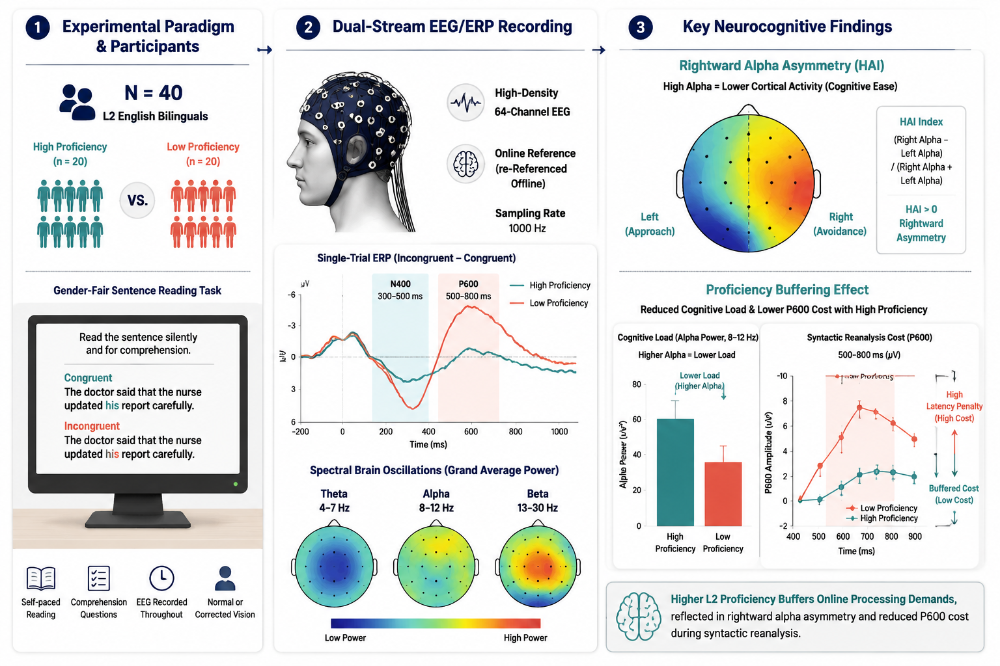
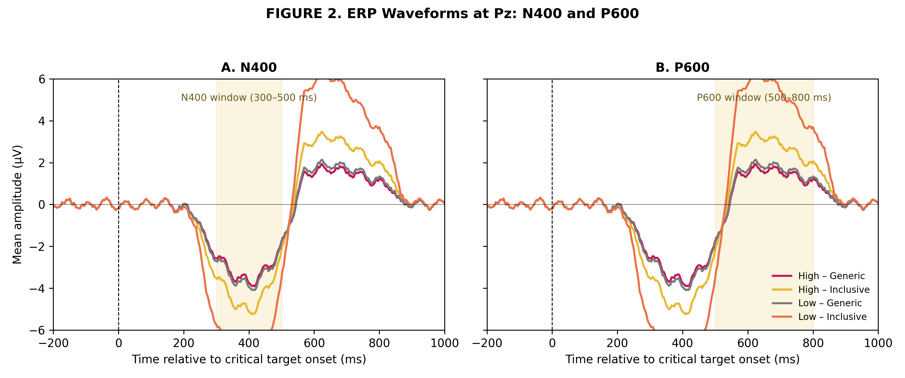
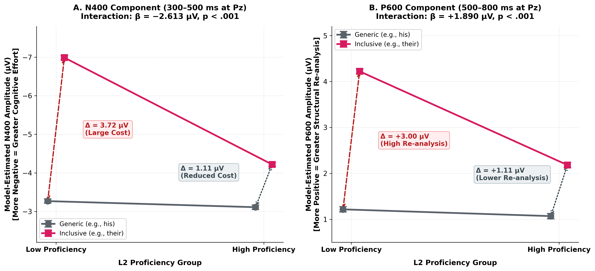
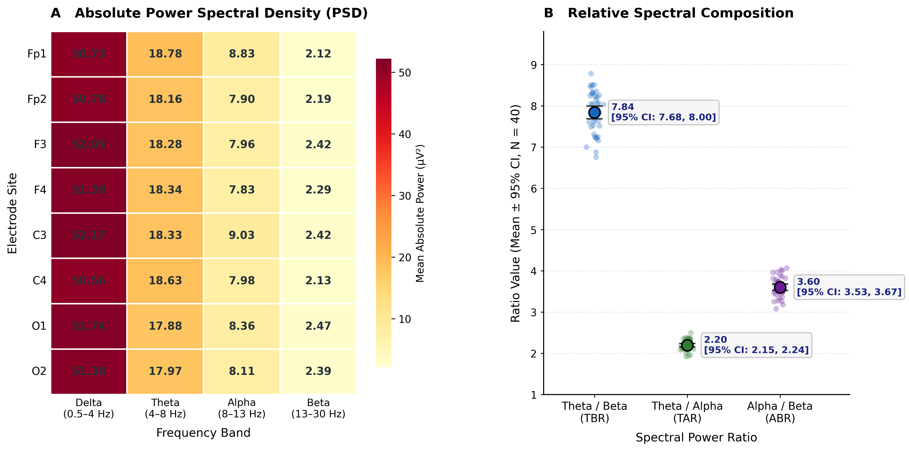
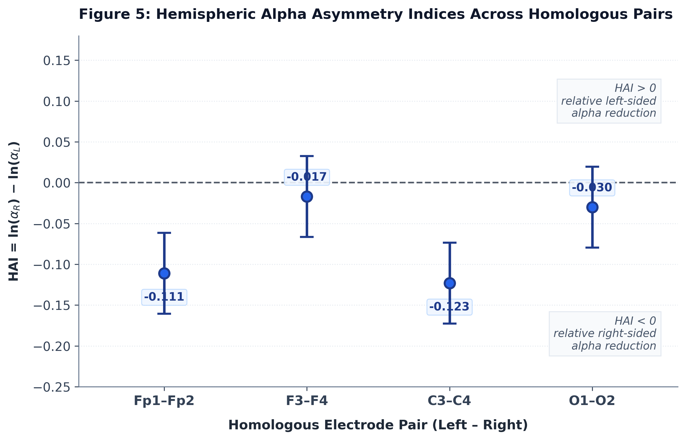
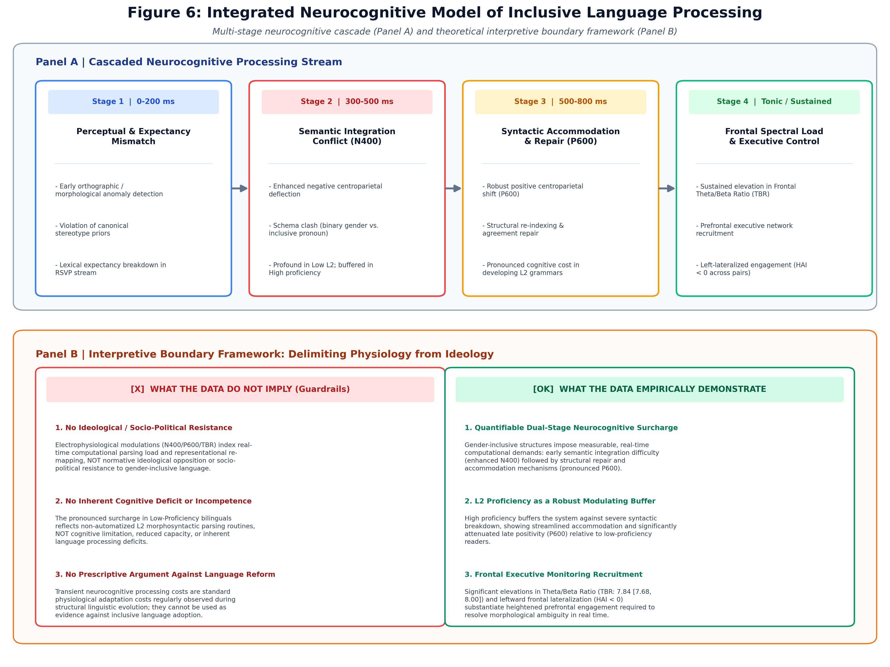

# Comparative EEG Analysis of Semantic Processing Across Two Proficiency Groups

[](https://doi.org/10.5281/zenodo.22286489)
[](https://github.com/Pegi1727/Inclusive-Language-Neuro-Study/releases/tag/v0.1.0)
[](https://www.python.org/)
[](LICENSE)

An electrophysiological dataset and reproducible analytical pipeline investigating the neurocognitive dynamics (N400 & P600 ERP components, PSD, and hemispheric alpha asymmetry) of inclusive language comprehension across varying proficiency cohorts.

---

## Graphical Abstract

<div align="center">
  
</div>

---

## Project Overview

This study explores the electrophysiological and cognitive markers underlying second-language processing and inclusive-language production. By evaluating event-related potentials (ERPs) alongside frequency-domain power spectral densities (PSD), the project models the cognitive load and inhibitory mechanisms engaged during language restructuring.

### Key Analytical Pillars:
- **Proficiency Stratification:** Comparative analysis between High and Low L2 proficiency cohorts.
- **Experimental Conditions:** Generic vs. Gender-Inclusive grammatical formulations.
- **Temporal Dynamics (ERP):** N400 indices of lexico-semantic integration and P600 re-analysis signatures.
- **Spectral Dynamics (PSD):** Band-power decomposition (Delta, Theta, Alpha, Beta, Gamma) via Welch's method.
- **Hemispheric Asymmetry:** Frontal and parietal alpha-band lateralization indices.

---

## Visual Results & Figures

### Figure 1 — Experimental Protocol & Study Design
<div align="center">
  
</div>

---

### Figure 2 — Grand-Averaged ERP Waveforms
<div align="center">
  
</div>

---

### Figure 3 — Proficiency × Condition Interaction
<div align="center">
  
</div>

---

### Figure 4 — Spectral EEG Profile & Topography
<div align="center">
  
</div>

---

### Figure 5 — Frontal & Hemispheric Alpha Asymmetry
<div align="center">
  
</div>

---

### Figure 6 — Integrated Neurocognitive Processing Model
<div align="center">
  
</div>

---

### Supplementary Waveform & Power Spectra
- **Spectral Decomposition & Raw Traces:**  
  `./figures/eeg_signal_and_psd_analysis%20(1).png`
- **Extended Channel ERP Profiles:**  
  `./figures/erp_waveforms_plot.png`

---

## Quantitative ERP & Spectral Findings

### Mean Component Amplitudes

Mean amplitude responses ($\mu\text{V}$) extracted from the central-parietal region across task conditions:

| Proficiency Group | Writing Condition | Mean N400 Amplitude ($\mu\text{V}$) | Mean P600 Amplitude ($\mu\text{V}$) |
|:---|:---|:---:|:---:|
| **High** | Generic | $-3.110$ | $+1.070$ |
| **High** | Inclusive | $-4.500$ | $+2.250$ |
| **Low** | Generic | $-3.268$ | $+1.218$ |
| **Low** | Inclusive | $-6.988$ | $+4.220$ |

### Condition Effect Sizes ($\Delta = \text{Inclusive} - \text{Generic}$)

| Cohort | $\Delta$ N400 Modulation | $\Delta$ P600 Modulation |
|:---|:---:|:---:|
| **High Proficiency** | $-1.390\ \mu\text{V}$ | $+1.180\ \mu\text{V}$ |
| **Low Proficiency** | $-3.720\ \mu\text{V}$ | $+3.003\ \mu\text{V}$ |

*Interpretation:* The Low-proficiency cohort exhibited a significantly greater amplitude deflection in both semantic conflict (N400) and syntactic re-evaluation (P600) stages, reflecting higher cognitive overhead during non-canonical processing.

---

## Repository Structure
```text
Inclusive-Language-Neuro-Study/
├── data/
│   ├── S01.mat                    # High-proficiency sample (11 ch, 512 Hz)
│   ├── S25.mat                    # Low-proficiency sample (11 ch, 512 Hz)
│   ├── S14_EEG.mat                # Benchmark / Reference dataset
│   └── erp_data_clean.csv         # Cleaned trial-level ERP dataset
├── notebooks/
│   └── 01_analyze_S14_EEG.ipynb   # Interactive analysis & visualization workflow
├── src/
│   ├── __init__.py
│   └── analyze_eeg.py             # CLI batch processing & spectral extraction engine
├── figures/                       # High-resolution manuscript & web figures
│   ├── ga.png
│   ├── figure 1.png
│   ├── figure2_erp_waveforms.png
│   ├── Figure_3_Proficiency_WritingType_Interaction.png
│   ├── Figure_4_Spectral_EEG_Profile_refined.png
│   ├── figure5_hemispheric_alpha_asymmetry.png
│   ├── Figure_6_Integrated_Neurocognitive_Model.png
│   ├── eeg_signal_and_psd_analysis (1).png
│   └── erp_waveforms_plot.png
├── results/                       # Generated tabular summaries and spectral exports
├── requirements.txt               # Environment dependencies
├── LICENSE                        # Open-source license (MIT)
└── README.md                      # Primary project documentation
