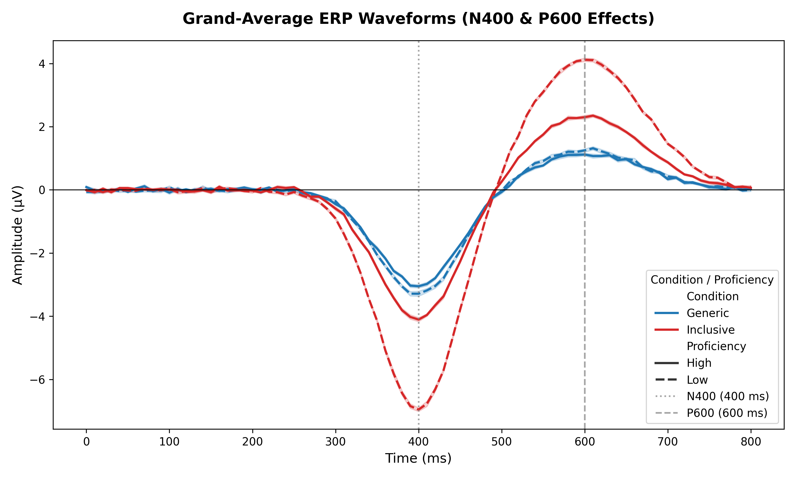

# Inclusive Language Neuro-Study

A multimodal neurocognitive research project examining the relationship between language proficiency, writing type, EEG spectral activity, ERP responses, and hemispheric asymmetry.

---
## Visual Results & Figures

## Graphical Abstract


### Figure 1 — Study Overview


---

### Figure 2 — ERP Waveforms


---

### Figure 3 — Proficiency × Writing-Type Interaction


---

### Figure 4 — Spectral EEG Profile


---

### Figure 5 — Hemispheric Alpha Asymmetry


---

### Figure 6 — Integrated Neurocognitive Model


---

### EEG Signal and PSD Analysis


---

### Additional ERP Waveforms Plot



## Project Overview

This project investigates neurocognitive aspects of second-language processing and inclusive-language production using behavioral, EEG, ERP, and computational measures.

The analytical framework focuses on:

- Language proficiency
- Writing type and task condition
- EEG spectral characteristics
- ERP waveform analysis
- Alpha-band hemispheric asymmetry
- Neural correlates of language control
- Cognitive control and inhibitory processing
- Integrated neurocognitive modeling

---
## Results Table

The quantitative EEG results are exported automatically by the analysis
pipeline as a CSV file:

[Download the channel summary table](./results/S14_channel_summary.csv)
## Numerical ERP Results

The following table reports the mean N400 and P600 amplitudes by proficiency
level and writing type. Values were calculated from `erp_data_clean.csv`.

| Proficiency | Writing Type | Mean N400 Amplitude | Mean P600 Amplitude |
|---|---|---:|---:|
| High | Generic | −3.110 | 1.070 |
| High | Inclusive | −4.500 | 2.250 |
| Low | Generic | −3.268 | 1.218 |
| Low | Inclusive | −6.988 | 4.220 |

### Within-Proficiency Differences

| Proficiency | Δ N400: Inclusive − Generic | Δ P600: Inclusive − Generic |
|---|---:|---:|
| High | −1.390 | 1.180 |
| Low | −3.720 | 3.003 |

The descriptive pattern indicates stronger condition-related ERP differences
for the Low-proficiency group than for the High-proficiency group. These
values are descriptive and should not be interpreted as inferential evidence
without an appropriate statistical model.

---
### Generated Output Files

After running the pipeline, the following files are generated in `results/`:
```text
results/
├── S14_channel_summary.csv
├── S14_mat_metadata.json
├── S14_raw_eeg.png
└── S14_psd.png


## Repository Structure
```text
.
├── data/
│   └── S14_EEG.mat
├── notebooks/
│   └── 01_analyze_S14_EEG.ipynb
├── src/
│   ├── __init__.py
│   └── analyze_eeg.py
├── results/
│   ├── Figure_3_Proficiency_WritingType_Interaction.png
│   ├── Figure_4_Spectral_EEG_Profile_refined.png
│   ├── Figure_6_Integrated_Neurocognitive_Model.png
│   ├── eeg_signal_and_psd_analysis (1).png
│   ├── erp_waveforms_plot.png
│   ├── figure 1.png
│   ├── figure2_erp_waveforms.png
│   ├── figure5_hemispheric_alpha_asymmetry.png
│   └── ga.png
├── requirements.txt
└── README.md
